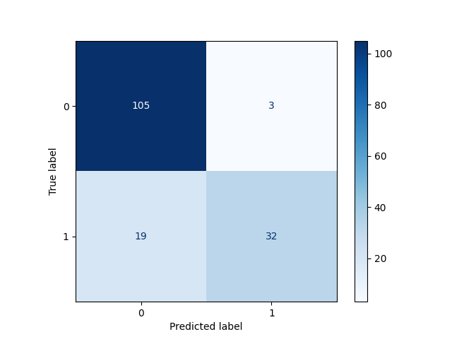
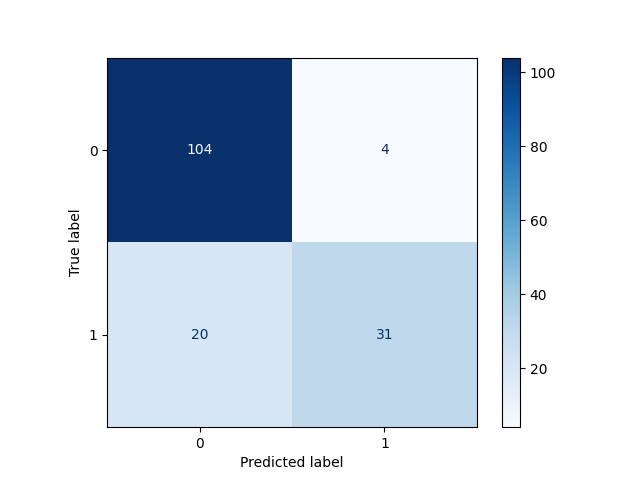

# IsConsultancy
This repo is small nlp project to classifiy companies into "is consultancy"

# Project structure
Here is the structure of the project:
````bash
./IsConsultancy/
├── data
│   └── nlp_data_scientist_challenge_dataset.csv
├── notebooks # the initial data exploration of the database
│   └── data-exploration.ipynb
├── output # saved confusion matrix
│   ├── cm_svc.png
│   └── cm_xgb.png
├── src # training pipeline
│   └── train.py
├── LICENSE
├── Makefile
├── README.md
├── requirements.txt
└── run.py # train the model with different settings

4 directories, 10 files
````
Folder notebook contains the initial data exploration of the database.
# Running the project:
## Pre-installation steps:
- Make sure you have python 3+ installed on your computer.
- Make sure you have pip3 package installed on your computer.
- Make sure you clone this package to your computer.

## Install requirements: 
In your terminal/command-line go to the project folder and execute the command below:
```bash
pip install -r requirements.txt
```
## Checking before building
Please run these make commands to make sure the formatting, linting and tests are working.
````commandline
make format
make lint
````
## Running the code 
To run the app locally just run the following command in bash in the root directory of the folder after setting the required parameters:
````bash
python run.py 
````

# Intuition and steps taken after exploration step

## Step 1: Data Splitting

- Divide the original DataFrame into training, validation, and test subsets.
- Use a ratio of 80:20 for training and test data, respectively.
- Set a specific random state to ensure reproducibility in data splitting.

## Step 2: Pipeline Creation

Create a Scikit-Learn pipeline for data preprocessing and modeling with the following components:

### a. Text Cleaning

- Clean the "text" column using a Spacy model to preprocess the text data.

### b. Feature Transformation

- Convert the cleaned text into TF-IDF (Term Frequency-Inverse Document Frequency) vectors, which represent the text data numerically.

### c. Feature Reduction

- Reduce the dimensionality of the TF-IDF features using TruncatedSVD.

### d. Model Training

- Train an XGBoost model or SVC model using the processed TF-IDF vectors.
- Use a categorical column named "group_id" from the original DataFrame as the target variable.
- Utilize cross-validation with the training subset for model training.
- Employ grid search to find the best hyperparameters for the XGBoost/SVC model.

## Step 3: Model Evaluation

- After model training, create a classification report to evaluate the model's performance.
- Generate a confusion matrix to gain insights into the model's classification accuracy and error patterns.

These steps encompass data preprocessing, feature engineering, and model training and evaluation, which are typical components of a machine learning workflow for preparing and assessing the performance of a classification model.

# Results:
Trained model results from Foundernest:
````bash
              precision    recall  f1-score   support

           0       0.80      0.89      0.84       565
           1       0.59      0.41      0.48       210

    accuracy                           0.76       775
   macro avg       0.69      0.65      0.66       775
weighted avg       0.74      0.76      0.75       775
````

### XGB model trained performance on test data: 
````bash
              precision    recall  f1-score   support

           0       0.85      0.97      0.91       108
           1       0.91      0.63      0.74        51

    accuracy                           0.86       159
   macro avg       0.88      0.80      0.82       159
weighted avg       0.87      0.86      0.85       159

````
Confusion matrix:

### SVC trained model performance on test data:

````bash
              precision    recall  f1-score   support

           0       0.84      0.96      0.90       108
           1       0.89      0.61      0.72        51

    accuracy                           0.85       159
   macro avg       0.86      0.79      0.81       159
weighted avg       0.85      0.85      0.84       159
````
Confusion matrix:


# Further Steps to improve the model:
The further steps to take to improve the results of the model.
* There is class imbalance that should be addressed using different techniques like smote etc.
* Verification of annotations/ ground truth.
* Grid search for hyper parameters of the models involved.
* Use more sophisticated embeddings from hugging face and other places to better convert it to better numerical embeddings
* The LLM models can also be used by using this example here: https://www.tome01.com/getting-started-with-langchain-for-text-classification-in-python.
* Feature engineering of new features extracted from text data.